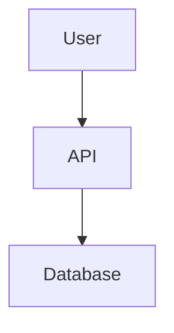

# md2docx

Convert a Markdown file containing Mermaid diagrams into a DOCX document with the diagrams rendered as images, using Pandoc and Mermaid CLI.

## Installation

```bash
git clone https://github.com/your-user/md2docx.git
cd md2docx
npm install
npm link
```

This will install the `md2docx` command globally from this project.

## Dependencies

You must have the following tools installed and available on your `PATH`:

- **Pandoc**: used to convert Markdown to DOCX  
  Install from: `https://pandoc.org/installing.html`

- **Mermaid CLI** (`mmdc`): used to render Mermaid diagrams to images  
  Install globally with:

  ```bash
  npm install -g @mermaid-js/mermaid-cli
  ```

The CLI will check for both `pandoc` and `mmdc` and exit with a clear error if either is missing.

## Usage

Basic usage:

```bash
md2docx architecture.md
```

This produces:

```text
architecture.docx
```

You can also specify an explicit output path:

```bash
md2docx architecture.md output.docx
```

## Example Markdown

Input file `architecture.md`:

```markdown
# Architecture


```

Run:

```bash
md2docx architecture.md
```

The output DOCX will contain the rendered flowchart as an embedded image instead of a Mermaid code block.

